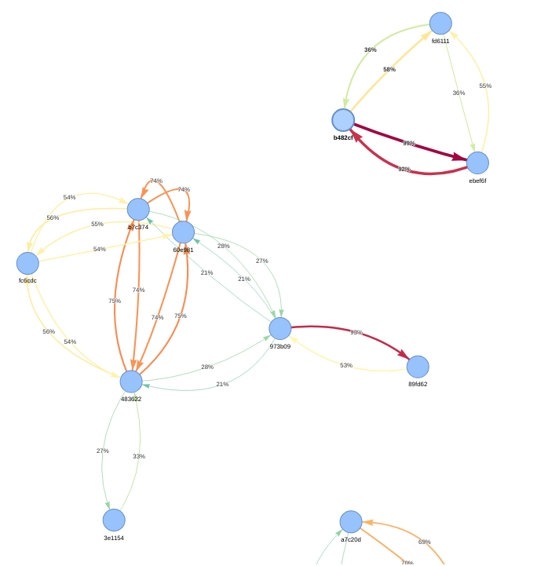

# MOSS for Gradescope 'Online Assignments'
As of this commit, gradescope online assignments are in beta and don't have code similarity checking.
This code enables sending code submitted with this assignment type to [MOSS](https://theory.stanford.edu/~aiken/moss/).

# Quickstart
1. Download the submissions of an 'online assignment' in gradescope using the 'Export Submissions' button.
2. Extract the archive. Within the directory, there should be a bunch of `submission_*******` directories and a `submission_metadata.csv` file
   - **Note:** if the submission metadata is in a different format, then `sort_submissions_gradescope.py` will need to be modified
3. Clone this repository anywhere.
4. Get a moss userid by [following the instructions on their website](https://theory.stanford.edu/~aiken/moss/).
5. From within the submission directory, run `MOSS_USERID=123456 wherever-you-cloned-this-repo/moss/check_similarity.sh "YYYY-MM-DD z"`,
where we have supplied the `MOSS_USERID` environment variable and the due date as an argument, with `z` as the UTC timezone such as +1000.
   - If you get an error about the file existing, then you can use `FORCE=TRUE` before the `MOSS_USERID` part to force overwrite any existing files.
   - This will install a python venv into the repo directory with the relevant dependencies and then sort the submissions, send them to moss, download the report and generate a directed node graph.
   - It will also output a `submissions_processed.csv`, which contains relevant information, most importantly the locations of any submitted PDFs and code files and the hours overdue if applicable, useful for sending the pdf to other similarity checkers or applying overdue penalties.
4. To clean the submissions directory, remove `./sorted`, `./lib/`, `./moss_report`, `./moss_network.html` and `./submissions_processed.csv`

# Detailed Usage
Run any of the python files with `-h` for the help message.
### `sort_submissions_gradescope.py`
processes the extracted submissions for a gradescope 'online assignment'
and outputs a processed csv file that contains the columns:
```
Submission ID,Student Names,Student IDs,Submitted Datetime,Overdue Hours,Code Files,PDF Files
```
This processing script assumes that the exported submissions have a `submission_metadata.csv` file.
Other assignment types might have a different metadata format (eg, programming assignments have a `yaml` file), so the script would have to be modified to deal with those.
I also take 'Q1 submitted time' as the default submission time, since we have been setting up assignments with only a single 'question'.
Obviously if this changes, the script would need modification to look at the submission time for all questions.

### `submit_to_moss.py`
takes the processed files from `sort_submissions_gradescope.py` and sends them to MOSS to generate and download a similarity report.

### `moss_nodes.py` 
generates a directed network graph of the submissions to visualise groups of similar ones without having to use your eyeballs to grep the similarity report.
An example graph with anonymized names is below.
Edges are labeled, sized and coloured based on similarity percentage.
Nodes are labeled with the names of the submitters (or a short sha256 hash if `--anonymize-names` is used).



### `check_similarity.sh`
contains a basic workflow that runs the programs above in succession given the due-date in the format 'YYYY-MM-DD HH:MM:SS z',
where z is the UTC timezone such as '+1000'.

The `MOSS_USERID` environment variable, or the `USERID` variable within the script must be set to a valid value.
Running this file once will create the virtual env 'moss_env' within the root directory of this repo.

Run each python file with the "--help" argument to see usage help.

There are comments at the start of each file with (maybe) more details.

